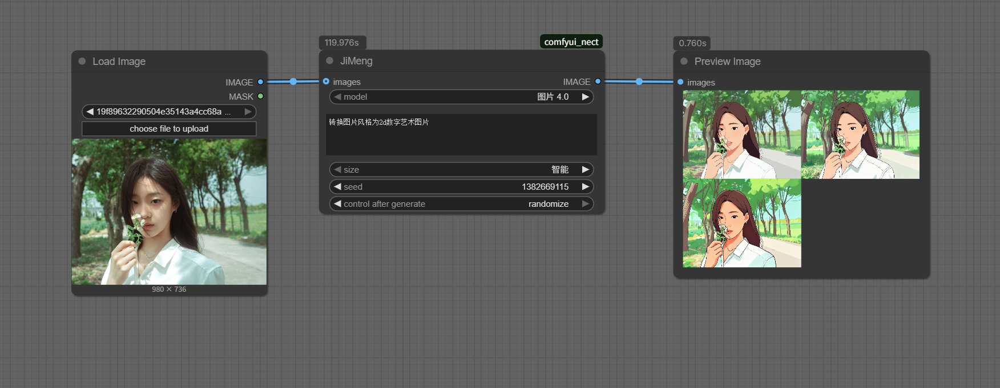

# ComfyUI Nect 插件

对接即梦平台生图的小工具

## 安装
1. 在Comfyui的python环境下执行：pip install -r requirements.txt
2. 在comfyui的python环境中执行
    ```bash
   python.exe -m playwright install chromium
   ```

## 使用
1. 执行工作流 [example-1.png](./docs/example-1.png)。第一次使用的时候会弹出即梦的首页，需要登录即梦账号，登录成功后页面会自动关闭，并继续执行工作流。

3. 工作流执行完成后，通常会输出4张图片（有时候因为网络原因，部分图片会下载失败，导致不足4张图片）。
